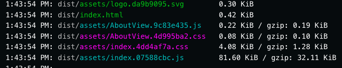

# dynamic-routes-after-deployment

This repo uses default Vue + Vue router template. It has two routes - Home (/)
and About (/about). About route is lazy-loaded. This causes an issue:

- Deploy site
- Open Home route
- Make changes to AboutView.vue
- Deploy site again
- Click on the /about link
- `Failed to fetch dynamically imported module` error will be thrown

It happens because `AboutView.vue` hash is different when changes are made it is
deployed the second time.

First deploy: 

Second deploy: 

While this doesn't seem like a big deal, it is quite significant source of
errors on large applications. One possible fix for this issue is to use
non-dynamic imports, but it may cause very long inital load times for
applications that have many large routes.
